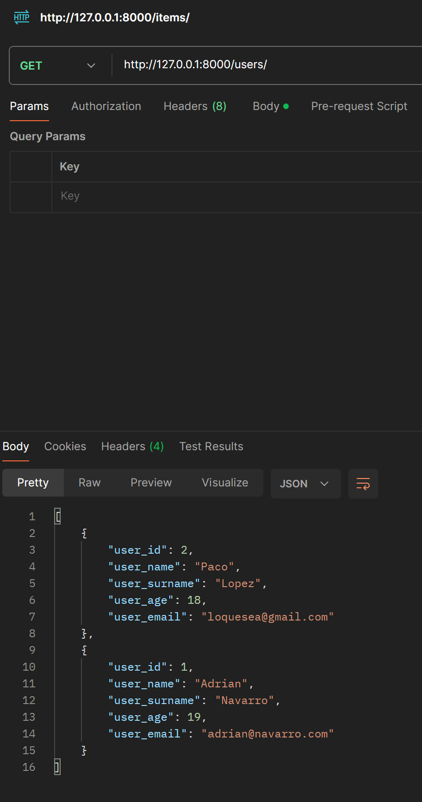

# FastAPI + PostgreSQL - Importació i Proves amb Postman

## **1. Importar un fitxer dins d'una carpeta**

`db_connect.py` dins de la carpeta `db_connect`, per poder-lo importar hem de seguir aquesta estructura:

```python
from db_connect.db_connect import create_connection
```

## **2. Prova des de Postman**

Com es veu, retorna els 2 usuaris que hi ha a la taula:


