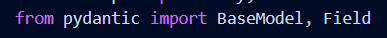
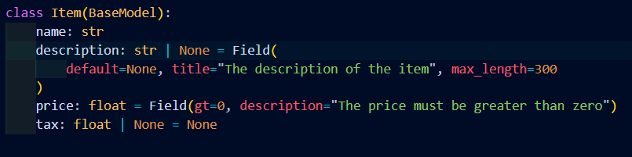
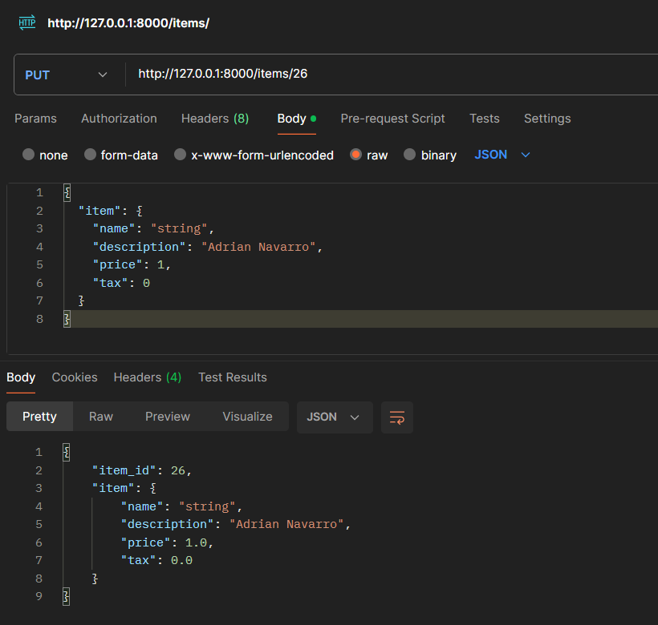

# Activitat 9 - Projecte FASTAPI Body Fields (Postman)

### 1. `Afegir l'import`

### 2. `Usar atributs amb Field`

### 3. `Probar-ho desde Postman`

Hem d'indicar quin id volem modificar ja que és un PUT. 

Després ja indiquem el body i finalment veiem la resposta que ens dona.

