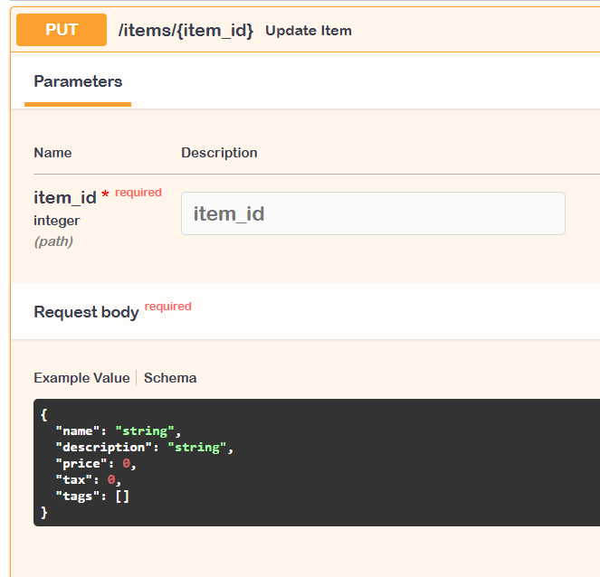

# Activitat 9 - Projecte FASTAPI Body Nested Modules (Swagger)

## Exemple: List Fields

Defino un atribut com un subtype, en aquest cas una llista. Utilitza un model de Pydantic que conté un camp `tags` definit com una llista.

### Codi

```python
from fastapi import FastAPI
from pydantic import BaseModel

app = FastAPI()


class Item(BaseModel):
    name: str
    description: str | None = None
    price: float
    tax: float | None = None
    tags: list = []


@app.put("/items/{item_id}")
async def update_item(item_id: int, item: Item):
    results = {"item_id": item_id, "item": item}
    return results
```

### Documentació generada

A Swagger, l'esquema que es genera automàticament mostra els detalls següents:


### Prova amb JSON

He provat l'endpoint `PUT /items/{item_id}` enviant el següent cos JSON:

```json
{
  "name": "Laptop",
  "description": "Gaming laptop",
  "price": 1500.0,
  "tax": 300.0,
  "tags": ["electronics", "computers"]
}
```

Aquest JSON conté el camp `tags` amb dos valors dins de la llista.

### Resposta obtinguda

El servidor ha processat correctament la petició i ha retornat la següent resposta:


```json
{
  "item_id": 26,
  "item": {
    "name": "Laptop",
    "description": "Gaming laptop",
    "price": 1500.0,
    "tax": 300.0,
    "tags": ["electronics", "computers"]
  }
}
```

---

## Exemple: List Fields amb Tipus Especificat

Defino un atribut com un subtype, en aquest cas una llista amb un tipus concret. El camp `tags` està definit com una llista de tipus `str` per garantir que tots els valors dins de la llista siguin cadenes de text.

### Codi

```python
from typing import List
from fastapi import FastAPI
from pydantic import BaseModel

app = FastAPI()


class Item(BaseModel):
    name: str
    description: str | None = None
    price: float
    tax: float | None = None
    tags: List[str] = []


@app.put("/items/{item_id}")
async def update_item(item_id: int, item: Item):
    results = {"item_id": item_id, "item": item}
    return results
```

### Documentació generada

El camp `tags` està definit com una llista de tipus `str`, per a que tots els elements siguin cadenes de text. A Swagger l'esquema generat automàticament mostra aquesta informació:



### Prova amb JSON

He provat l'endpoint `PUT /items/{item_id}` amb el següent cos JSON:

```json
{
  "name": "Smartphone",
  "description": "A high-end smartphone",
  "price": 800.0,
  "tax": 150.0,
  "tags": ["electronics", "mobile"]
}

```

Aquest JSON conté el camp `tags` amb dos valors de tipus `str`.

### Resposta obtinguda

El servidor ha processat correctament la petició i ha retornat la següent resposta:


```json
{
  "item_id": 27,
  "item": {
    "name": "Smartphone",
    "description": "A high-end smartphone",
    "price": 800.0,
    "tax": 150.0,
    "tags": ["electronics", "mobile"]
  }
}
```

---

## Exemple: Submodels

Defino un submodel per representar imatges (`Image`) i l'utilitzo com un atribut del model `Item`. Això permet tenir un camp dins de `Item` que és un altre model amb els seus propis atributs.

### Codi

```python
from fastapi import FastAPI
from pydantic import BaseModel

app = FastAPI()


class Image(BaseModel):
    url: str
    name: str


class Item(BaseModel):
    name: str
    description: str | None = None
    price: float
    tax: float | None = None
    tags: list = []
    image: Image | None = None


@app.put("/items/{item_id}")
async def update_item(item_id: int, item: Item):
    results = {"item_id": item_id, "item": item}
    return results
```

### Documentació generada

El camp `image` està definit com un submodel amb atributs `url` i `name`. A Swagger l'esquema generat automàticament mostra aquesta informació.


### Prova amb JSON

He provat l'endpoint `PUT /items/{item_id}` amb el següent cos JSON:

```json
{
  "name": "Tablet",
  "description": "A powerful tablet",
  "price": 1200.0,
  "tax": 200.0,
  "tags": ["electronics", "tablet"],
  "image": {
    "url": "https://www.dohatna.com.qa/wp-content/uploads/2023/07/BeigeGalaxy-Tab-S9-Ultra_Beige_Product-Image_Combo-1536x1024.png",
    "name": "Tablet Image"
  }
}
```

Aquest JSON conté el camp `image` que és un submodel, amb els atributs `url` i `name`.

### Resposta obtinguda

El servidor ha processat correctament la petició i ha retornat la següent resposta:


```json
{
  "item_id": 26,
  "item": {
    "name": "Tablet",
    "description": "A powerful tablet",
    "price": 1200,
    "tax": 200,
    "tags": [
      "electronics",
      "tablet"
    ],
    "image": {
      "url": "https://www.dohatna.com.qa/wp-content/uploads/2023/07/BeigeGalaxy-Tab-S9-Ultra_Beige_Product-Image_Combo-1536x1024.png",
      "name": "Tablet Image"
    }
  }
}
```

---

## Exemple: Llista de Submodels

Defino un submodel per representar imatges (`Image`) i l'utilitzo dins d'una llista al model `Item`. Això permet tenir una estructura de dades on cada element d'una llista és un submodel, és útil per representar múltiples elements dins d'un atribut.

### Codi

```python
from fastapi import FastAPI
from pydantic import BaseModel, HttpUrl

app = FastAPI()


class Image(BaseModel):
    url: HttpUrl
    name: str


class Item(BaseModel):
    name: str
    description: str | None = None
    price: float
    tax: float | None = None
    tags: list = []
    images: list[Image] | None = None


@app.put("/items/{item_id}")
async def update_item(item_id: int, item: Item):
    results = {"item_id": item_id, "item": item}
    return results
```

### Documentació generada

En aquest endpoint, el camp `images` és una llista de submodels `Image`, cadascun amb els atributs `url` i `name`. A Swagger, l'esquema generat automàticament mostra aquesta informació:


### Prova amb JSON

He provat l'endpoint `PUT /items/{item_id}` amb el següent cos JSON:

```json
{
  "name": "Camera",
  "description": "A high-resolution camera",
  "price": 2500.0,
  "tax": 400.0,
  "tags": ["electronics", "camera"],
  "images": [
    {
      "url": "https://example.com/camera1.jpg",
      "name": "Front view"
    },
    {
      "url": "https://example.com/camera2.jpg",
      "name": "Side view"
    }
  ]
}
```

Aquest JSON conté el camp `images` que és una llista amb dos submodels `Image`.

### Resposta obtinguda

El servidor ha processat correctament la petició i ha retornat la següent resposta:

```json
{
  "item_id": 26,
  "item": {
    "name": "Camera",
    "description": "A high-resolution camera",
    "price": 2500.0,
    "tax": 400.0,
    "tags": ["electronics", "camera"],
    "images": [
      {
        "url": "https://example.com/camera1.jpg",
        "name": "Front view"
      },
      {
        "url": "https://example.com/camera2.jpg",
        "name": "Side view"
      }
    ]
  }
}
```


