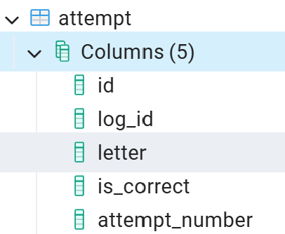
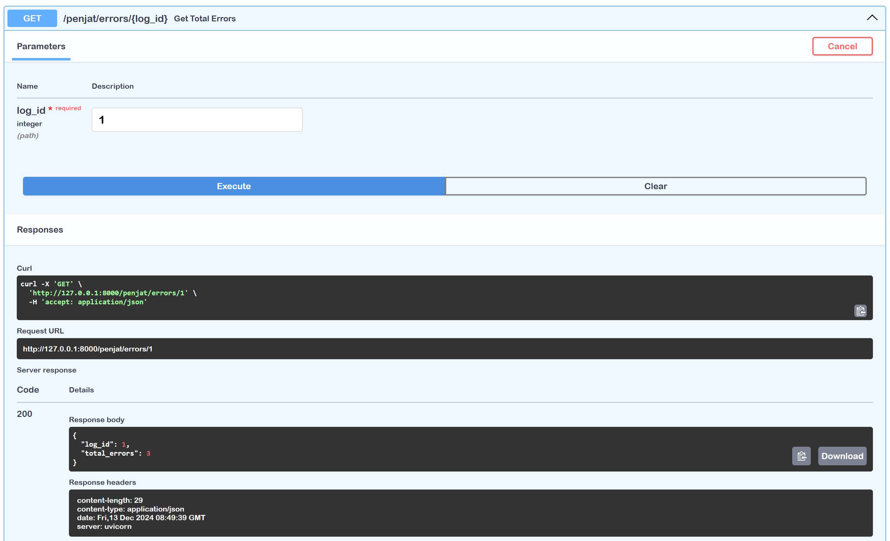
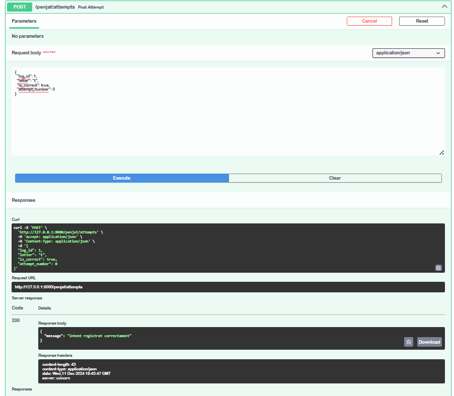
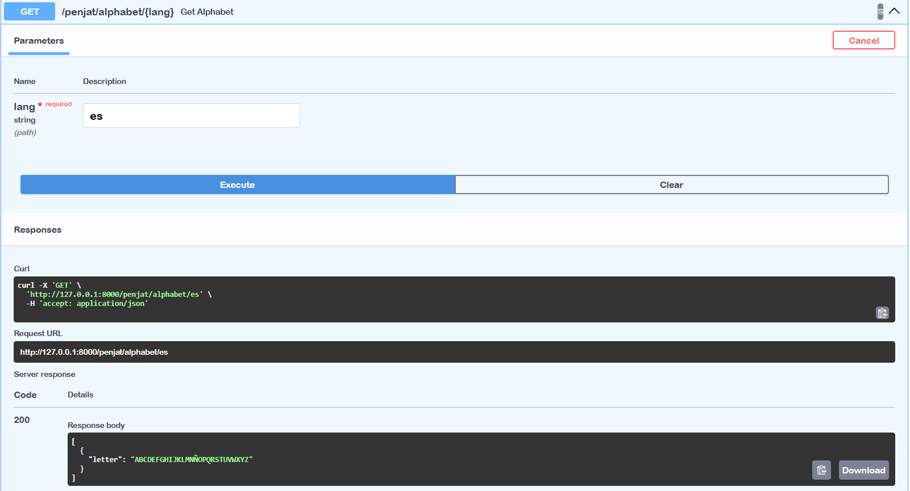
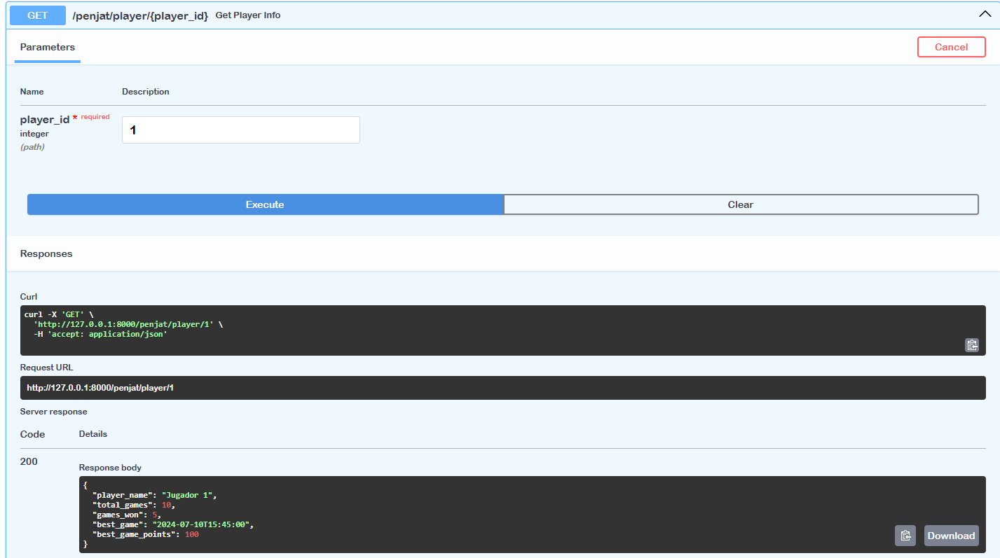

# ACTIVITAT_11

## Base de dades

### Disseny Base de Dades

### Base de Dades creada a Postgresql
#### He afegit una taula amb els intents per a registrar cada vegada que el jugador usa una lletra

### Taula Attempt
#### Aquesta taula té els següents camps:

#### Amb el is_correct podem després treure els errors que ha fet en la partida corresponent.

## Endpoints amb Swagger

### GET /penjat/start-game

#### Aquest endpoint serveix per a l'endpoint 1 i 2 demanats ja que retorna el mateix text recollint-lo de la base de dades

### GET /penjat/errors/{log_id}
#### Retorna el nombre d'errors

### POST /penjat/attempts
#### Per Insertar un intent

### GET /penjat/alphabet/{lang}
#### Agafar l'abecedari corresponent

### GET /penjat/player/{player_id}
#### Agafar les estadístiques del jugador
