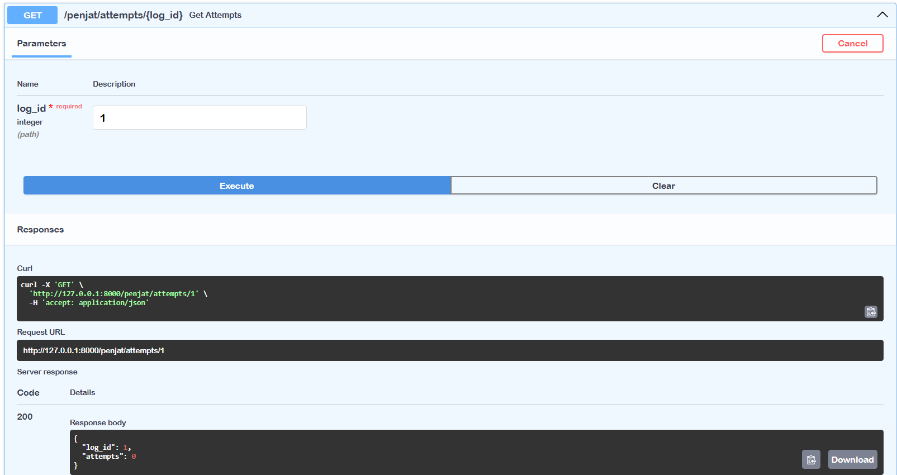
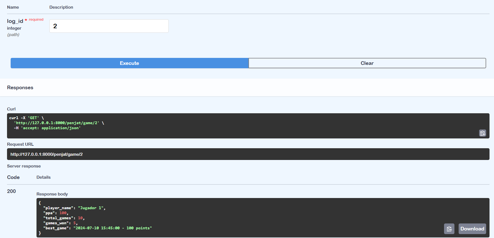

# ACTIVITAT_11

## Base de dades

### Disseny Base de Dades

### Base de Dades creada a Postgresql

## Endpoints amb Swagger

### GET /penjat/start-game

#### Aquest endpoint serveix per a l'endpoint 1 i 2 demanats ja que retorna el mateix text recollint-lo de la base de dades

### GET /penjat/attempts/1

### POST /penjat/attempts

### GET /penjat/alphabet/{lang}

### GET /penjat/player/{player_id}

