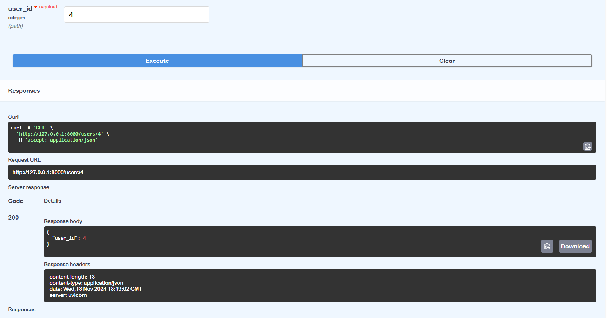
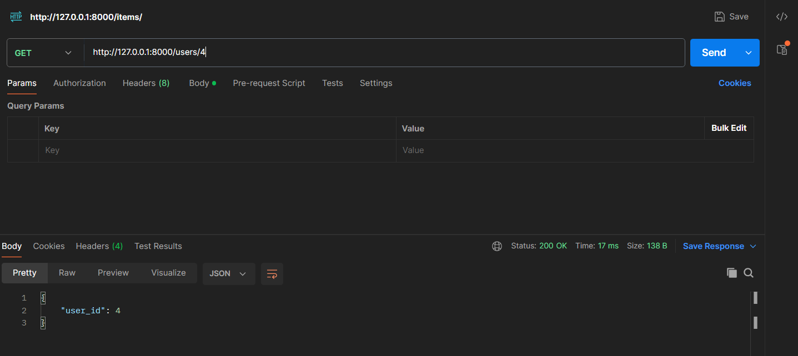
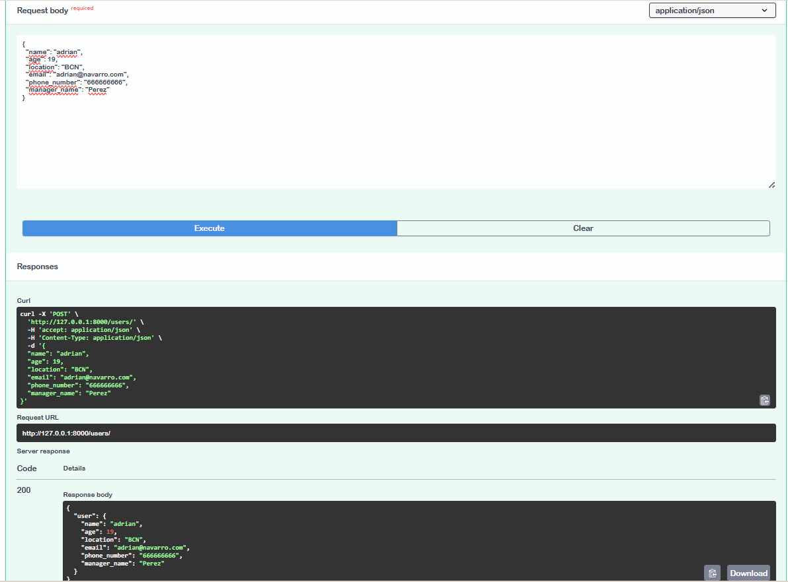
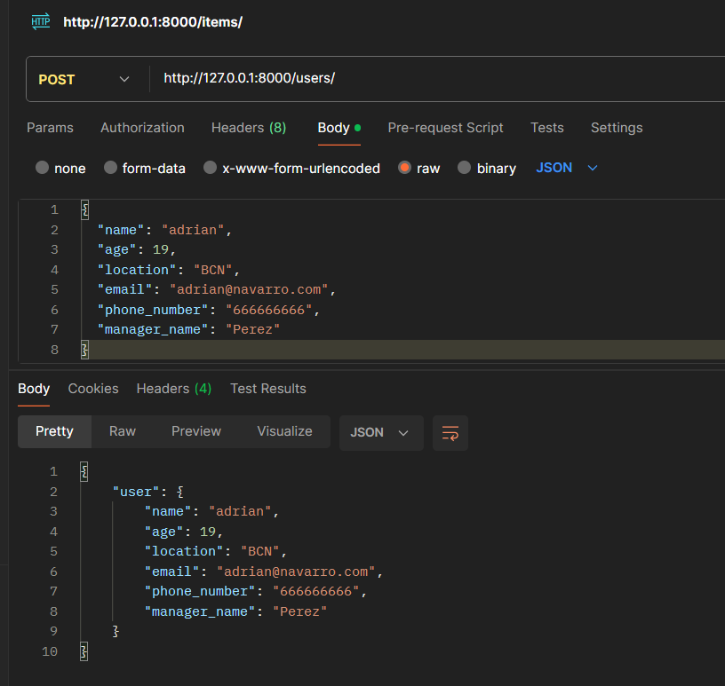
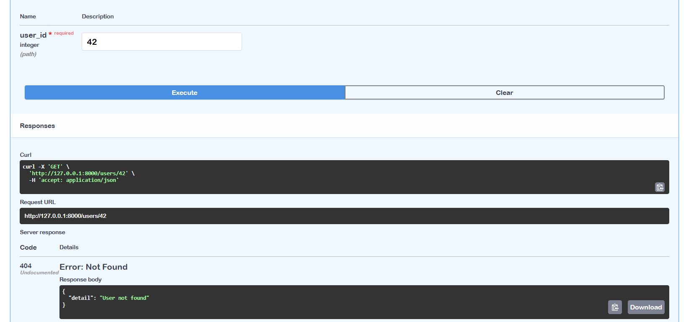
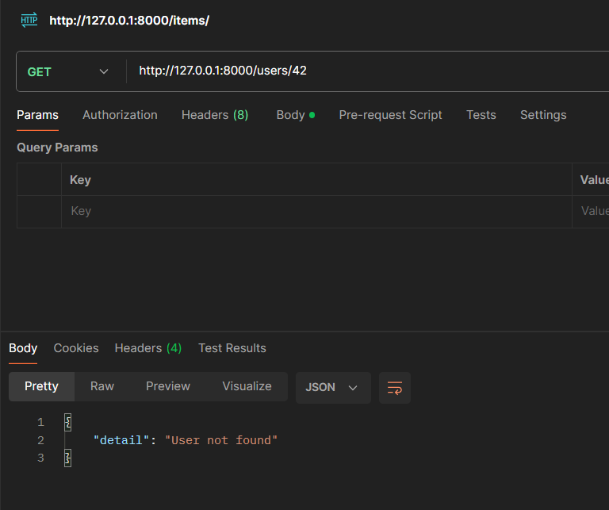
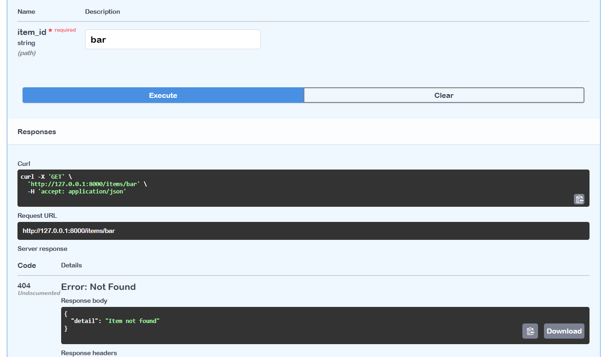
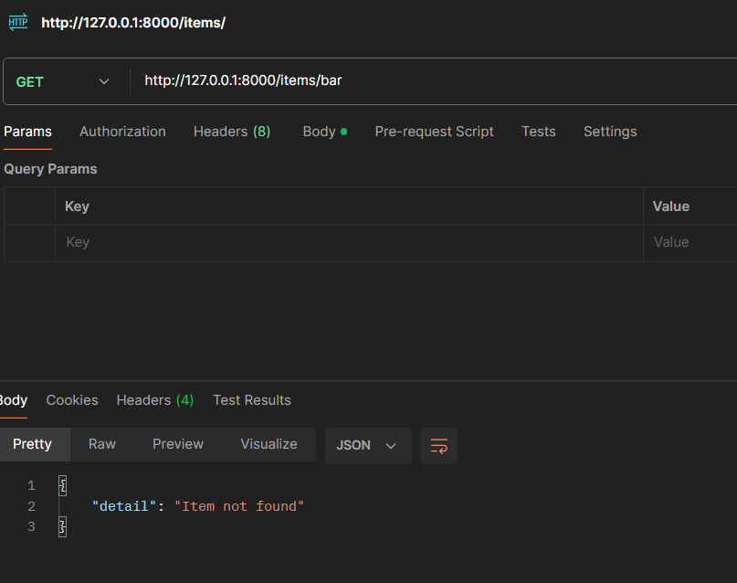

# Activitat 8 - Projecte FASTAPI

Mètodes **GET** i **POST** i el maneig d'errors amb **Response** i **HTTPException**.

## Captures de Pantalla
### 1. `GET /users/{user_id}` (Swagger)

Aquesta captura mostra la prova de l'endpoint **GET** amb **Swagger**, on es verifica la resposta correcta quan es proporciona un `user_id` existent.

### 2. `GET /users/{user_id}` (Postman)

En aquesta captura es pot veure la sol·licitud **GET** realitzada amb **Postman**, confirmant la resposta correcta per un `user_id` existent.

### 3. `POST /users/` (Swagger)

Aquesta captura mostra la sol·licitud **POST** per crear un usuari nou, realitzada a través de **Swagger**.

### 4. `POST /users/` (Postman)

En aquesta captura es pot observar la sol·licitud **POST** feta amb **Postman** per afegir un nou usuari.

### 5. `GET /users/{user_id}` - Error 404 (Swagger)

Aquesta captura mostra l'error **404** amb **Swagger**, quan es prova accedir a un `user_id` inexistent.

### 6. `GET /users/{user_id}` - Error 404 (Postman)

En aquesta captura, es pot veure la resposta d'error **404** amb **Postman**, quan es prova un `user_id` que no existeix.

### 7. `GET /items/{item_id}` - HTTPException (Swagger)

Aquesta captura mostra la gestió de l'error amb `HTTPException` a **Swagger** per a l'endpoint **GET** d'`items` amb un `item_id` inexistent.

### 8. `GET /items/{item_id}` - HTTPException (Postman)

Aquesta captura mostra l'error gestionat amb `HTTPException` quan es prova un `item_id` que no existeix, utilitzant **Postman**.